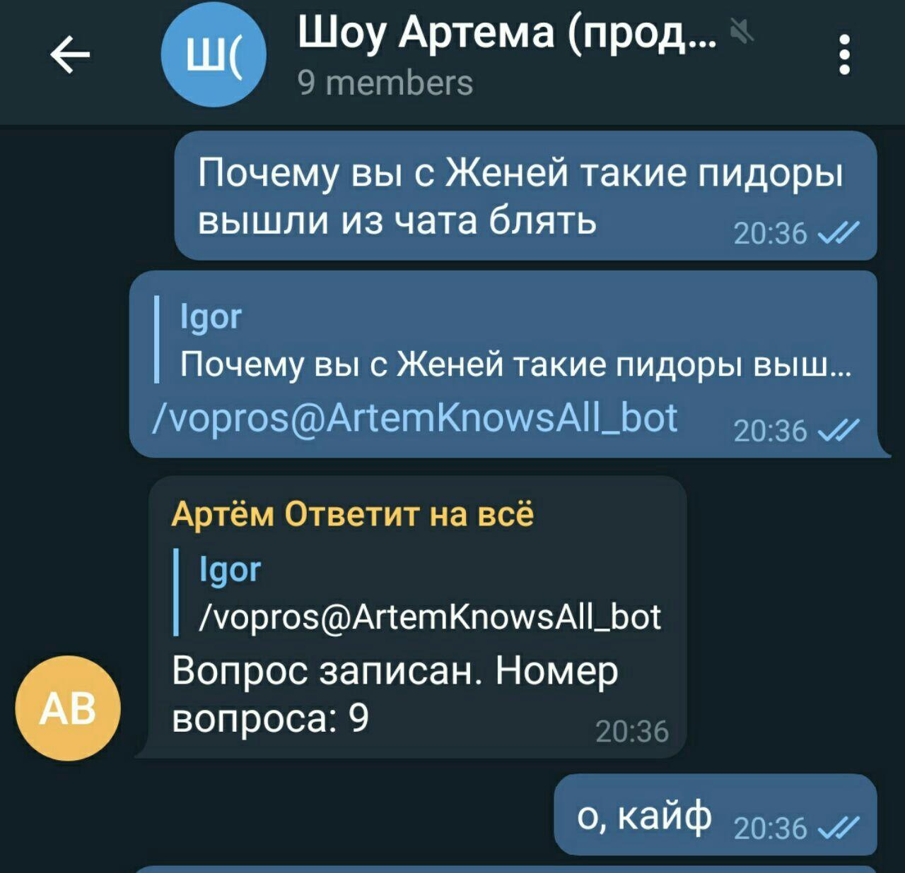
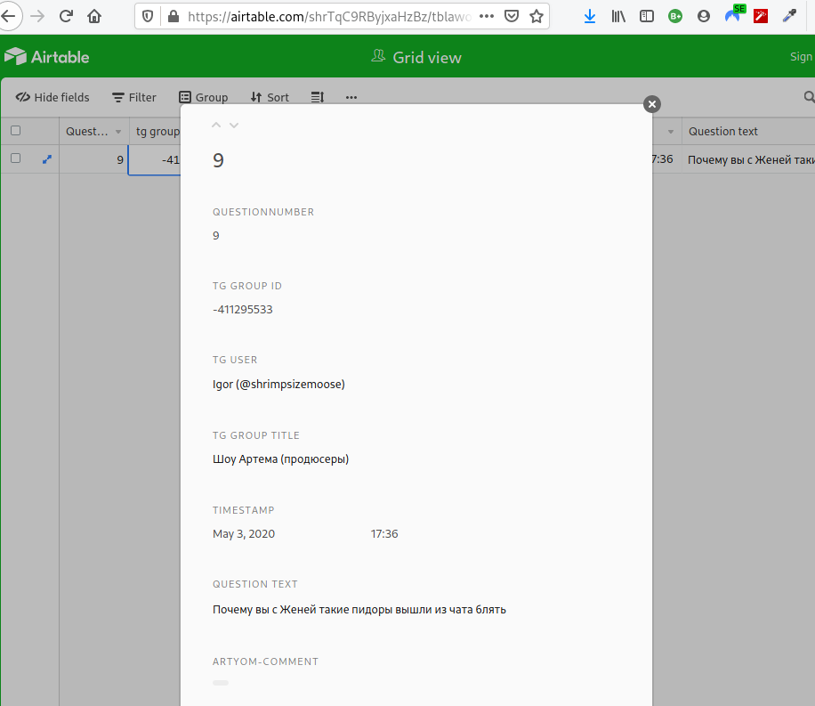

# question-bot

Бот для приёма вопросов в телеге

## Что этот бот делает и как

Бота можно добавить в любой чат и по реплаю к сообщению с командой /vopros данные о вопросе будут появляться табличке в airtable. То есть вопрос задаётся командой боту и потом появляется в табличке airtable

В чатике                    |  В табличке
:--------------------------:|:---------------------------------------:
  |   


# Сборка и запуск

```
make @build

make docker-run
```

Можно ещё `make docker-run-daemon` если хочется сразу отпустить консоль. Понадобится .env-файл с конфигурацией

## Example .env file

Ожидаемые переменные окружения:
```
ARTEM_BOT_TOKEN=1804549634:AA[.......................]9lBEuHMI

AIRTABLE_API_URL=https://api.airtable.com/v0/appQ[.........]5R/QuestionsInputs
AIRTABLE_API_SECRET=key[..........]cP
```

Скопируй `.env.template` в `.env`, поправь как надо и вперёд.

### Note on telegram privace mode

Так как боту надо знать что было в сообщении ответа, ему надо отключить privacy mode. Для того чтобы он видел сообщения, боту надо добавить возможность их читать. Это делает в настройках бота у BotFather (disable Privacy Mode где-то там внутри меню)

## Схема таблицы в Airtable

Поля:

* `QuestionNumber`: айдишник вопроса, primary key, autoincrement
* `tg group id`: айдишник группы где кто-то задал вопрос безобразие
* `tg group title`: название группы на момент возникновения вопроса
* `timestamp`: время, когда запись была добавлена (GMT, автозаполняется)
* `Question text`: текст вопроса &mdash; исходное сообщение
* `artyom-comment`: поле для комментария от Артёма.
